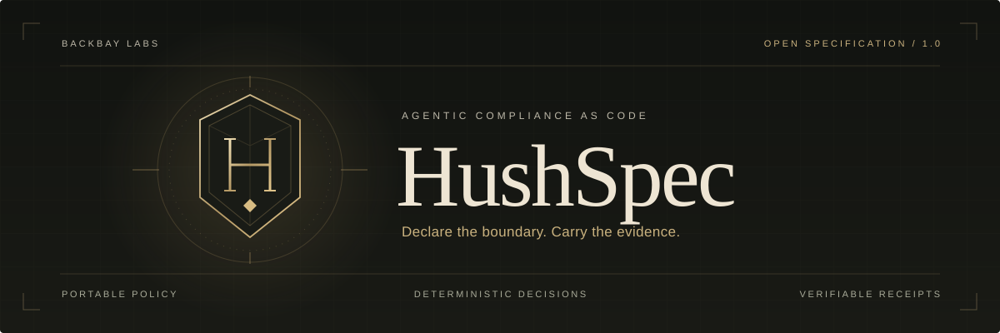
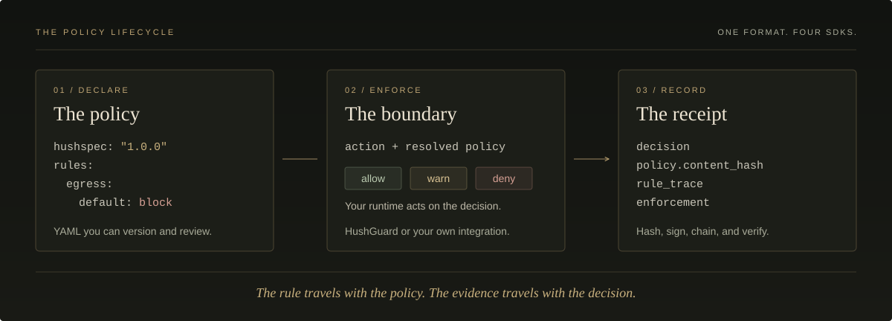

<p align="center">
  <picture>
    <source media="(max-width: 600px)" srcset="assets/hero-mobile.svg" />
    
  </picture>
</p>

<p align="center">
  <a href="https://github.com/backbay-labs/hush/actions/workflows/ci.yml"></a>
  <a href="spec/versioning.md"></a>
  <a href="docs/src/reference/sdk-conformance.md"></a>
  <a href="LICENSE"></a>
</p>

<p align="center">
  <strong>Give your agents boundaries you can read. Get decisions you can verify.</strong>
</p>

<p align="center">
  <a href="#what-is-hushspec">What</a>&nbsp;&nbsp;&middot;&nbsp;&nbsp;
  <a href="#quickstart">Quickstart</a>&nbsp;&nbsp;&middot;&nbsp;&nbsp;
  <a href="#from-policy-to-proof">How it works</a>&nbsp;&nbsp;&middot;&nbsp;&nbsp;
  <a href="#sdks-and-integrations">SDKs</a>&nbsp;&nbsp;&middot;&nbsp;&nbsp;
  <a href="#policy-tooling">CLI</a>&nbsp;&nbsp;&middot;&nbsp;&nbsp;
  <a href="#policy-library">Policies</a>&nbsp;&nbsp;&middot;&nbsp;&nbsp;
  <a href="docs/src/introduction.md">Docs</a>&nbsp;&nbsp;&middot;&nbsp;&nbsp;
  <a href="spec/hushspec-core.md">Spec</a>
</p>

---

## What is HushSpec?

HushSpec is an open specification for the security controls an AI agent operates under.
Write a policy in YAML, evaluate it in Rust, TypeScript, Python, or Go, and produce
receipts that tie each decision to the policy behind it.

It covers the things agents actually touch: files, networks, shells, tools, browsers,
and code execution. The spec defines the rules and their meaning; your runtime
enforces the boundary through `HushGuard` or its own integration.

| Declare | Enforce | Prove |
| :--- | :--- | :--- |
| Reviewable YAML with reusable base policies and explicit permissions. | Consistent `allow`, `warn`, and `deny` decisions at the point of action. | Decision receipts, policy signatures, and verifiable logs. |

**Spec 1.0.0 is stable.** The document format, evaluation semantics, canonical form,
and wire formats are frozen for the 1.x series. See the
[versioning policy](spec/versioning.md) and [SDK conformance matrix](docs/src/reference/sdk-conformance.md)
for the contracts and their test coverage.

The 1.0 SDK release is not yet published. See the [delivery status](docs/plans/STATUS.md)
for implementation, qualification, and release evidence.

The experimental [external conformance controller](docs/src/reference/external-conformance.md)
tests a captured executable against the L0-L3 corpus and retains its inputs,
outputs and identity. The Go adapter is first-party bring-up, not independent
engine or runtime-boundary qualification.

## Quickstart

Build the `h2h` CLI from this checkout:

```sh
cargo install --path crates/hushspec-cli --locked
```

Save this as `policy.yaml`. It protects credentials, restricts network access,
and asks for confirmation before a tool can write a file or push code.

<!-- example: quickstart-policy -->
```yaml
hushspec: "1.0.0"
name: production-agent

rules:
  forbidden_paths:
    patterns: ["**/.ssh/**", "**/.aws/**", "/etc/shadow"]

  egress:
    allow: ["api.openai.com", "*.anthropic.com", "api.github.com"]
    default: block

  tool_access:
    allow: [file_read, search]
    block: [shell_exec, run_command]
    require_confirmation: [file_write, git_push]
    default: block
```

Validate it, then try three decisions:

```sh
h2h validate policy.yaml

h2h eval policy.yaml --type egress --target api.openai.com
# allow

h2h eval policy.yaml --type tool_call --target shell_exec
# deny

h2h eval policy.yaml --type tool_call --target file_write
# warn: confirmation required
```

These commands evaluate actions; they do not execute them. `eval` exits with
`0` for allow, `1` for deny, and `4` for warn. A runtime must handle the decision
before dispatching the action. [Wire it into your agent →](#from-policy-to-proof)

<details>
<summary><strong>More installation options</strong></summary>

| Method | Install |
| :--- | :--- |
| Cargo | `cargo install hushspec-cli` |
| Homebrew | `brew install backbay-labs/tap/h2h` |
| npm | `npm install -g @hushspec/cli` |
| Prebuilt binaries | [GitHub Releases](https://github.com/backbay-labs/hush/releases), with checksums and provenance attestations |

Packaged installers depend on the release pipeline having published the corresponding
artifacts. The source install above builds directly from this checkout.

For a scaffolded policy and test suite, run `h2h init --preset default`.
See the [first-policy guide](docs/src/guides/first-policy.md) for the complete workflow.

</details>

## From policy to proof

<p align="center">
  <picture>
    <source media="(max-width: 600px)" srcset="assets/policy-flow-mobile.svg" />
    
  </picture>
</p>

### Put the check before the action

`HushGuard` loads the policy and brings evaluation, enforcement modes, confirmation,
receipt sinks, and observers together. Call `enforce` before dispatching a tool:

```typescript
import { HushGuard } from '@hushspec/core';

const guard = HushGuard.fromFile('./policy.yaml');

guard.enforce({ type: 'tool_call', target: 'shell_exec' });
// Throws HushSpecDenied under the quickstart policy.
```

A policy that fails required signature verification produces a refused guard:
every action is denied with `__hushspec_policy_unverified__`. A failed hot reload
keeps the last valid policy in force. Unknown fields and invalid documents are
rejected explicitly.

The enforcement boundary is the runtime's responsibility. HushSpec supplies the
portable policy contract and SDK primitives to build it.
[Runtime integration guide →](docs/src/guides/runtime-integration.md)

### Keep the evidence with the decision

Audited evaluation takes a resolved policy and returns a receipt containing its
canonical `content_hash`, the decision, actor context, rule and detection traces,
and enforcement disposition. Action content is represented by its hash and byte
size, without embedding the raw content.

```sh
# Inspect the receipt for one evaluated action.
h2h eval policy.yaml --type egress --target api.openai.com --format receipt
```

The evidence can travel beyond the runtime:

| Artifact | What you can verify |
| :--- | :--- |
| [Policy signature](spec/hushspec-signing.md) | Which key signed the resolved policy, including its inherited rules. |
| [Decision receipt](spec/hushspec-receipt.md) | Which policy and recorded rule outcomes produced the decision. |
| [Receipt log](spec/hushspec-log.md) | Hash links between entries, with the first broken link identified by line. |
| [Policy bundle](spec/hushspec-bundle.md) | A DSSE attestation over an in-toto statement describing the policy. |

Ed25519 signatures cover the resolved policy's content hash, so reformatting a file
preserves its signature while changing an inherited rule invalidates it. Signing,
receipt verification, and bundle verification are available across all four SDKs;
Rust requires the `signing` feature and Python the `signing` extra.

## SDKs and integrations

One policy language across four SDKs. The shared corpus checks evaluation,
canonical bytes, policy hashes, and receipt formats across implementations.

Until 1.0 is published, use this source checkout. The registry commands below
are for the upcoming release, not currently available 1.0 packages.

| SDK | Registry install after publication | Reference |
| :--- | :--- | :--- |
| Rust | `cargo add hushspec` | [Crate](crates/hushspec/README.md) |
| TypeScript | `npm install @hushspec/core` | [Package](packages/hushspec/README.md) |
| Python | `pip install hushspec` | [Package](packages/python/README.md) |
| Go | `go get github.com/backbay-labs/hush/packages/go@v1.0.0` | [Module](packages/go/README.md) |

The Go SDK release will use the nested `packages/go/v1.0.0` tag.
For signing, use `hushspec = { version = "1.0", features = ["signing"] }` in Rust
or `pip install "hushspec[signing]"` in Python.

<details>
<summary><strong>Start with your language: Rust · TypeScript · Python · Go</strong></summary>

### Rust

<!-- smoke: readme-rust -->
```rust
use hushspec::HushSpec;

let yaml_str = "hushspec: \"1.0.0\"\nname: example\n";
let spec = HushSpec::parse(yaml_str)?;
let result = hushspec::validate(&spec);
assert!(result.is_valid());
```

### TypeScript

<!-- smoke: readme-typescript -->
```typescript
import { parseOrThrow, validate } from '@hushspec/core';

const yamlString = 'hushspec: "1.0.0"\nname: example\n';
const spec = parseOrThrow(yamlString);
const result = validate(spec);
console.log(result.valid); // true
```

### Python

<!-- smoke: readme-python -->
```python
from hushspec import parse_or_raise, validate

yaml_string = 'hushspec: "1.0.0"\nname: example\n'
spec = parse_or_raise(yaml_string)
result = validate(spec)
assert result.is_valid
```

### Go

<!-- smoke: readme-go -->
```go
import (
    "fmt"

    "github.com/backbay-labs/hush/packages/go/hushspec"
)

yamlString := "hushspec: \"1.0.0\"\nname: example\n"
spec, err := hushspec.Parse(yamlString)
if err != nil {
    panic(err)
}
result := hushspec.Validate(spec)
fmt.Println(result.IsValid())
```

</details>

### Framework adapters

Adapters translate tool calls into HushSpec actions without importing the framework
they adapt. Use the same policy across agent stacks.

| Framework | TypeScript | Python | Go |
| :--- | :---: | :---: | :---: |
| Claude / Anthropic | ✓ | ✓ | ✓ |
| OpenAI | ✓ | ✓ | ✓ |
| MCP | ✓ | ✓ | ✓ |
| LangChain | ✓ | ✓ | - |
| Vercel AI SDK | ✓ | - | - |
| CrewAI | - | ✓ | - |

Rust applications can start from the
[`guarded_agent` example](crates/hushspec/examples/guarded_agent.rs).
[Adapter entry points →](docs/src/reference/sdk-api.md#framework-adapters)

<details>
<summary><strong>SDK parity, optional features, and conformance</strong></summary>

All four SDKs reach **Level 5 (Attested)** against the shared vector corpus with
signing enabled. The [conformance matrix](docs/src/reference/sdk-conformance.md)
names the test files behind each claim; the [API contract](docs/src/reference/sdk-api.md)
maps the public entry points.

| Capability | Availability |
| :--- | :--- |
| Parse, validate, merge, resolve, and compiled evaluation | All four SDKs |
| Twelve rule blocks, three extensions, and `when` conditions | All four SDKs |
| Reference detectors, including `heuristic_injection@1` | All four SDKs |
| Canonical hashes, audited evaluation, and chained receipt logs | All four SDKs |
| Policy and receipt signing; bundle verification | All four; Rust `signing` feature, Python `signing` extra |
| Bundle creation | All four SDKs and `h2h bundle create` |
| Guard, enforcement modes, observers, metrics, and receipt sinks | All four; Go names its guard `Guard` |
| OTLP export | All four; Rust `otlp` feature |
| HTTPS policy loading | Rust `http` feature, TypeScript; explicit loaders in Python and Go |
| Policy providers, hot reload, and panic mode | All four SDKs |

CI runs shared fixtures, canonical roundtrips, README snippet smoke tests, and
differential evaluation over 500 generated policy groups. See the
[workflow](.github/workflows/ci.yml) for the checks.

</details>

## Policy tooling

The `h2h` CLI covers the policy lifecycle in 22 commands.

| Workflow | Commands |
| :--- | :--- |
| Author and inspect | `init` · `validate` · `lint` · `fmt` · `schema` · `resolve` · `diff` |
| Evaluate and test | `eval` · `explain` · `test` |
| Sign and verify | `keygen` · `hash` · `sign` · `verify` · `bundle` |
| Audit and operate | `audit` · `log` · `receipts` · `report` · `panic` · `completions` · `version` |

```sh
# Show the rules behind a decision.
h2h explain policy.yaml --type egress --target api.example.com

# Fail CI when a policy change can relax a denial.
h2h diff main.yaml pr.yaml --fail-on relaxed

# Check your policy's control mappings.
h2h audit policy.yaml --controls --strict

# Verify a hash-linked receipt log.
h2h log verify receipts.jsonl
```

The [CLI reference](docs/src/reference/cli.md) covers flags, JSON/SARIF/JUnit output,
and exit codes. [Editor setup](docs/src/guides/editor-setup.md) adds schema validation
and completions while you write.

<details>
<summary><strong>Validate policies in GitHub Actions</strong></summary>

```yaml
- uses: backbay-labs/hush@v1.0.0
  with:
    command: validate
    paths: policies/**/*.yaml
```

The [composite action](action.yml) downloads the matching CLI release and verifies
its checksum and build provenance. Before release binaries are available, set
`version: source` to build the CLI. The [CI integration guide](docs/src/guides/ci.md)
also covers SARIF, JUnit, pre-commit hooks, and containers.

</details>

## Policy library

Start with a built-in policy and extend it for your environment. Rulesets and
library policies are embedded in all four SDKs.

| Starting point | Policies |
| :--- | :--- |
| Everyday agents | [`default`](rulesets/default.yaml), [`ai-agent`](rulesets/ai-agent.yaml) |
| Tighter or looser controls | [`strict`](rulesets/strict.yaml), [`permissive`](rulesets/permissive.yaml) |
| Specialized environments | [`cicd`](rulesets/cicd.yaml), [`remote-desktop`](rulesets/remote-desktop.yaml) |
| Emergency stop | [`panic`](rulesets/panic.yaml), plus the runtime deny-all kill switch |
| Control-mapped templates | [Healthcare, finance, government, education, DevOps, and general policies](library/README.md) |

```yaml
hushspec: "1.0.0"
name: clinical-agent
extends: "builtin:library/healthcare/hipaa-base"
```

Library templates include structured control mappings and
[control-tagged evaluation suites](fixtures/library/README.md). They are starting
points for your environment, not compliance certifications.

<details>
<summary><strong>Twelve rule blocks and three extensions</strong></summary>

| Surface | Rule blocks |
| :--- | :--- |
| Files and content | `forbidden_paths`, `path_allowlist`, `secret_patterns`, `patch_integrity` |
| Network | `egress` |
| Tools and execution | `tool_access`, `shell_commands`, `code_execution` |
| Browsers and desktops | `browser_automation`, `computer_use`, `remote_desktop_channels`, `input_injection` |

Optional extensions add [posture](spec/hushspec-posture.md) state machines,
[origin-aware](spec/hushspec-origins.md) policy projection, and
[detection](spec/hushspec-detection.md) thresholds. Core rules stay declarative;
extensions carry the additional behavior.

See the [rules reference](docs/src/rules-reference.md) and
[action types](docs/src/action-types.md) for field-level details.

</details>

HushSpec policies also load natively in
[Clawdstrike](docs/src/guides/clawdstrike.md).

## Specification

The specification is the contract. The SDKs, schemas, and fixtures make it executable.

| Read | For |
| :--- | :--- |
| [Core specification](spec/hushspec-core.md) | Document format, rule blocks, evaluation, and conformance |
| [Canonical form](spec/hushspec-canonical.md) | Portable policy identity and RFC 8785 canonicalization |
| [Receipts](spec/hushspec-receipt.md) · [Signing](spec/hushspec-signing.md) | Decision evidence, signature envelopes, keys, and verification |
| [Bundles](spec/hushspec-bundle.md) · [Logs](spec/hushspec-log.md) | Policy attestations and hash-linked audit trails |
| [Posture](spec/hushspec-posture.md) · [Origins](spec/hushspec-origins.md) · [Detection](spec/hushspec-detection.md) | Optional extension contracts |
| [Grammars](spec/hushspec-grammars.md) · [JSON Schema](schemas/) | String formats and machine-readable validation |
| [Security considerations](spec/hushspec-security.md) | Guidance for engines and policy authors |
| [Versioning](spec/versioning.md) · [Errata](spec/errata.md) | Stability guarantees and specification corrections |

## Contributing

The [contributor guide](CONTRIBUTING.md) covers setup, checks, and the fixture-first
workflow for SDK changes. Specification changes follow the
[governance process](GOVERNANCE.md); vulnerabilities go through
[security reporting](SECURITY.md).

<details>
<summary><strong>Repository map</strong></summary>

```text
spec/        Normative specifications and registries
schemas/     JSON Schema definitions
crates/      Rust SDK, h2h CLI, and conformance testkit
packages/    TypeScript, Python, and Go SDKs
rulesets/    Built-in security policies
library/     Control-mapped policy templates
fixtures/    Shared conformance and evaluation vectors
docs/        Guides, references, and mdBook sources
generated/   Shared SDK contract artifacts
scripts/     Code generation and CI checks
```

</details>

---

<p align="center">
  <strong>HushSpec</strong><br />
  <sub>Declare the boundary. Carry the evidence.</sub>
</p>

<p align="center">
  <a href="LICENSE">Apache-2.0</a>&nbsp;&nbsp;&middot;&nbsp;&nbsp;
  <a href="CHANGELOG.md">Changelog</a>&nbsp;&nbsp;&middot;&nbsp;&nbsp;
  <a href="GOVERNANCE.md">Governance</a>&nbsp;&nbsp;&middot;&nbsp;&nbsp;
  <a href="SECURITY.md">Security</a>
</p>
